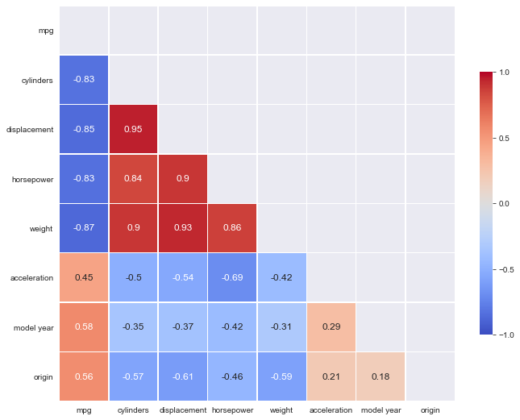

# Machine-Learning Deployment

### Please go through the branches of this repo.

Each branches will contain individual projects.
The purpose of having each project in separate branches is to make it feasible to deploy wth Heroku Platform.

A collection of End-to-End machine learning projects, from data gathering to model deployment.

## Project List:

- [MPG-Score](#mpg-score)
<!-- [Source Code](https://github.com/rekib0023/Machine-Learning-Deployment/tree/MPG-Score) [Live Preview](https://mpg-score.herokuapp.com/) -->
- [Heart Disease](#heart-disease)
<!-- [Source Code](https://github.com/rekib0023/Machine-Learning-Deployment/tree/Heart-Disease) [Live Preview](https://heartdisease-classifier.herokuapp.com/predict) -->

---

## MPG-Score

**Problem Statement:** Building a regression model to predict the miles per gallon score of your automobile depending on the features of your automobile.

**Data Source:** The data is collected from UCI Machine Learning Repository http://archive.ics.uci.edu/ml/datasets/Auto+MPG

**Data Description:**
The attribute information:

1. mpg: continuous
1. cylinders: multi-valued discrete(3-8)
1. displacement: continuous
1. hosrepower: continuous
1. weight: continuous
1. accelaration: continuous
1. model year: multi-valued discrete (70-82)
1. origin: multi-valued discrete (1-3)
1. car name: categorical

Shape of the dataset: (398 X 9)

Correlation:

**Models Used:**
An stacked model is used by averaging XGBRegressor, RandomForestRegressor, and LinearRegression

**Model Evaluation:**

| Model                    | MAE     | RMSE    | R2_Score |
| ------------------------ | ------- | ------- | -------- |
| LinearRegression         | 0.07654 | 0.09946 | 0.89061  |
| Ridge(L2 regularization) | 0.07679 | 0.10006 | 0.88928  |
| Lasso(L1 regularization) | 0.07685 | 0.10050 | 0.88831  |
| ElasticNet               | 0.07690 | 0.10055 | 0.88819  |
| RandomForestRegressor    | 0.06692 | 0.09117 | 0.90807  |
| XGBRegressor             | 0.06868 | 0.09219 | 0.90601  |
| Averaging Model          | 0.06871 | 0.09048 | 0.90946  |

Source Code: https://github.com/rekib0023/Machine-Learning/tree/master/MPG%20Score
Live Preview: https://mpg-score.herokuapp.com/