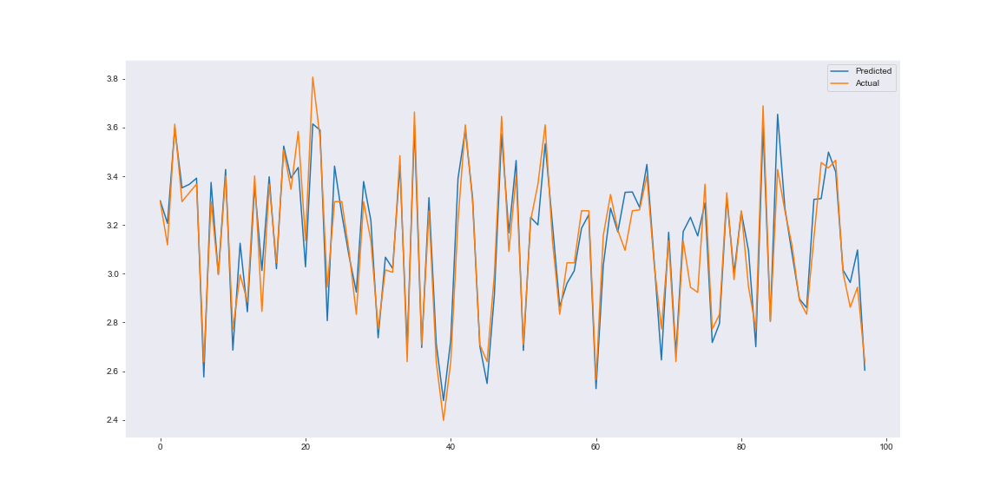
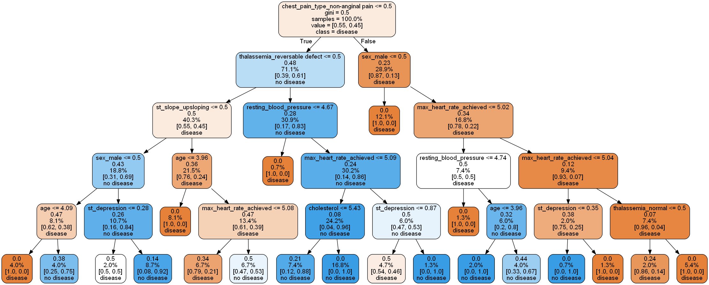

# Machine-Learning Deployment

### Please go through the branches of this repo.

Each branches will contain individual projects.
The purpose of having each project in separate branches is to make it feasible to deploy wth Heroku Platform.

A collection of End-to-End machine learning projects, from data gathering to model deployment.

## Project List:

- [MPG-Score](#mpg-score)

- [Heart Disease](#heart-disease-classifier)

---

## MPG-Score

**Problem Statement:** Building a regression model to predict the miles per gallon score of your automobile depending on the features of your automobile.

**Data Source:** The data is collected from UCI Machine Learning Repository http://archive.ics.uci.edu/ml/datasets/Auto+MPG

**Data Description:**
The attribute information:

1. mpg: continuous
1. cylinders: multi-valued discrete(3-8)
1. displacement: continuous
1. hosrepower: continuous
1. weight: continuous
1. accelaration: continuous
1. model year: multi-valued discrete (70-82)
1. origin: multi-valued discrete (1-3)
1. car name: categorical

Shape of the dataset: (398, 9)

Correlation:

**Models Used:**
An stacked model is used by averaging XGBRegressor, RandomForestRegressor, and LinearRegression

**Model Evaluation:**

| Model                    | MAE     | RMSE    | R2_Score |
| ------------------------ | ------- | ------- | -------- |
| LinearRegression         | 0.07654 | 0.09946 | 0.89061  |
| Ridge(L2 regularization) | 0.07679 | 0.10006 | 0.88928  |
| Lasso(L1 regularization) | 0.07685 | 0.10050 | 0.88831  |
| ElasticNet               | 0.07690 | 0.10055 | 0.88819  |
| RandomForestRegressor    | 0.06692 | 0.09117 | 0.90807  |
| XGBRegressor             | 0.06868 | 0.09219 | 0.90601  |
| Averaging Model          | 0.06871 | 0.09048 | 0.90946  |

The below graph show the predicted values with respect to the actual ones.

The blue line depicts the predicted values, and the orange line depicts actual values.

Source Code: https://github.com/rekib0023/Machine-Learning/tree/master/MPG%20Score

Live Preview: https://mpg-score.herokuapp.com/

---

## Heart Disease Classifier

**Problem Statement:** Building a classification model to classify if the patient has heart disease or not depending on few medical conditions of the patient.

**Data Source:** The data is collected from UCI Machine Learning Repository https://archive.ics.uci.edu/ml/datasets/Heart+Disease

**Data Description:**
The attribute information:

1.  age: The person's age in years
1.  sex: The person's sex (1 = male, 0 = female)
1.  cp: The chest pain experienced (Value 1: typical angina, Value 2: atypical angina, Value 3: non-anginal pain, Value 4: asymptomatic)
1.  trestbps: The person's resting blood pressure (mm Hg on admission to the hospital)
1.  chol: The person's cholesterol measurement in mg/dl
1.  fbs: The person's fasting blood sugar (> 120 mg/dl, 1 = true; 0 = false)
1.  restecg: Resting electrocardiographic measurement (0 = normal, 1 = having ST-T wave abnormality, 2 = showing probable or definite left ventricular hypertrophy by Estes' criteria)
1.  thalach: The person's maximum heart rate achieved
1.  exang: Exercise induced angina (1 = yes; 0 = no)
1.  oldpeak: ST depression induced by exercise relative to rest ('ST' relates to positions on the ECG plot. See more here)
1.  slope: the slope of the peak exercise ST segment (Value 1: upsloping, Value 2: flat, Value 3: downsloping)
1.  ca: The number of major vessels (0-3)
1.  thal: A blood disorder called thalassemia (3 = normal; 6 = fixed defect; 7 = reversable defect)
1.  target: Heart disease (0 = no, 1 = yes)

Shape of the dataset: (303, 14)

**Models Used:**
An optimized RandomForestClassifier is used.

**Model Evaluation:**

| Model                            | Sensitivity | Specificity | AUC_Score |
| -------------------------------- | ----------- | ----------- | --------- |
| LogisticRegression               | 0.89189     | 0.87179     | 0.93698   |
| KNeighborsClassifier             | 0.80487     | 0.85714     | 0.93074   |
| SVC                              | 0.84615     | 0.86486     | 0.93074   |
| RandomForestClassifier           | 0.84615     | 0.86486     | 0.93144   |
| Optimized RandomForestClassifier | 0.85        | 0.88888     | 0.93905   |

The following graph shows the split of the RandomForestClassifier:

Source Code: https://github.com/rekib0023/Machine-Learning-Deployment/tree/Heart-Disease

Live Preview: https://heartdisease-classifier.herokuapp.com/

---
